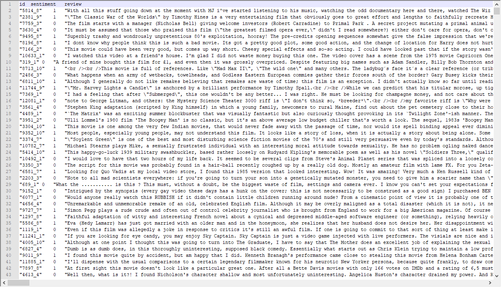
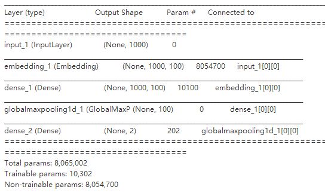
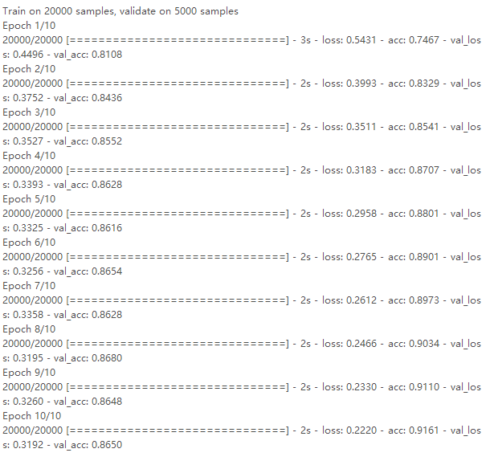

## 项目进展报告

### 数据获取及预处理

本项目数据集取自https://www.kaggle.com/c/word2vec-nlp-tutorial/data ，其中包含25000条带标注的IMDB电影评论数据和75000条无标注的评论数据。其中review是评论文本，sentiment是情感分类标注，1代表positive，即评分5分及以上；0代表negative，即评分0-4.9分。

数据集结构如下图所示

数据集需要进行预处理，例如过滤掉一些非ASCII字符，清洗掉一些换行符，将大写字母转换为小写等。

### 数据分析与可视化

目前实现了利用多层感知器模型的分类，生成的网络结构如下

以此网络进行分类的结果如下

### 模型选取

我们计划采用多层感知器模型(MLP)和长短期记忆网络(LSTM)，来对比两种模型的效率和分类精度。

### 挖掘实验的结果

目前实现了多层感知器模型，8次迭代后分类准确率约86%

### 存在的问题

数据预处理时出现了无法输出的字符，导致程序出现了错误，后查明是编码问题，所以采取了将非ASCII字符剔除的方法。

### 下一步工作

下一步准备实现LSTM和Attention层机制。